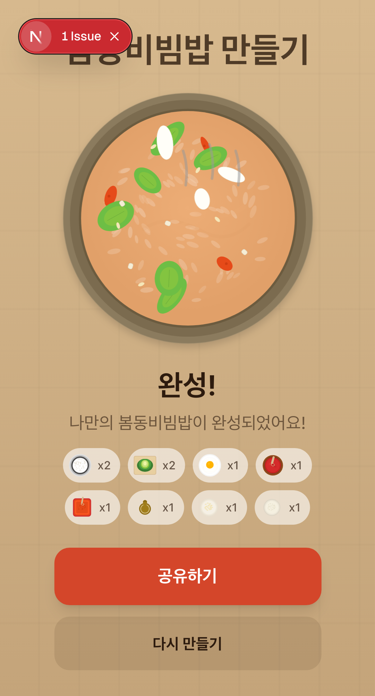
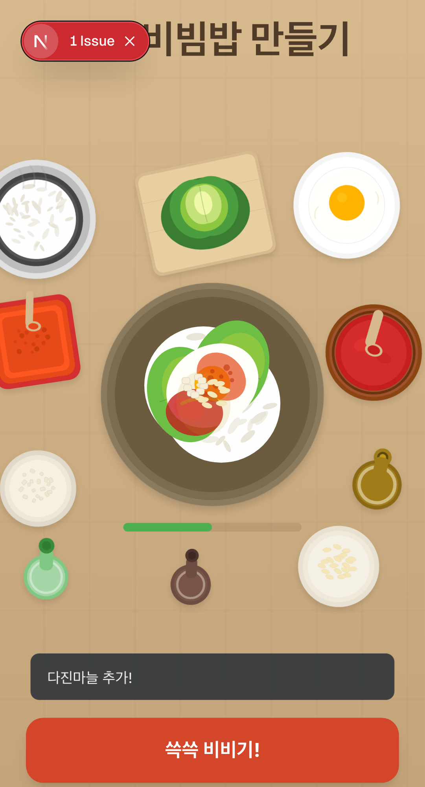
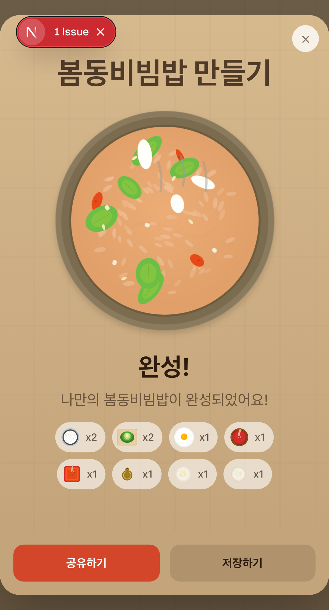

# 봄동비빔밥 만들기

봄동비빔밥 조리 시뮬레이터 - 식탁 위 재료를 직접 골라 그릇에 넣고, 나만의 봄동비빔밥을 만들어보세요!



## Features

- 식탁 위에 놓인 재료들을 **드래그 앤 드롭**으로 그릇에 투입
- 재료가 **드롭한 위치에 그대로** 쌓임
- 넣은 재료 비율에 따라 **비빔밥 색감이 동적으로 변화**
  - 고추장 많이 = 빨간 비빔밥, 참기름 많이 = 금빛 윤기
  - 밥알 텍스처, 봄동/계란흰자/깨/마늘/고춧가루 건더기가 양에 비례
- 밥이 있을 때만 김이 모락모락
- 그릇 용량 게이지로 적절한 양 조절
- 완성된 비빔밥을 **이미지로 공유** (Web Share API / 다운로드)

## Screenshots

| 조리 화면 | 재료 투입 | 완성 | 공유 |
|:-:|:-:|:-:|:-:|
|  |  |  |  |

## Tech Stack

- [Next.js](https://nextjs.org/) (App Router)
- [Seed Design](https://seed-design.io/) (Daangn Design System)
- [Tailwind CSS](https://tailwindcss.com/) v4
- SVG illustrations (hand-crafted)
- [html2canvas-pro](https://github.com/nicolo-ribaudo/html2canvas-pro) (이미지 공유)
- [Playwright](https://playwright.dev/) (E2E 테스트)

## Getting Started

```bash
npm install
npm run dev
```

http://localhost:3000 에서 확인하세요.

## License

MIT
